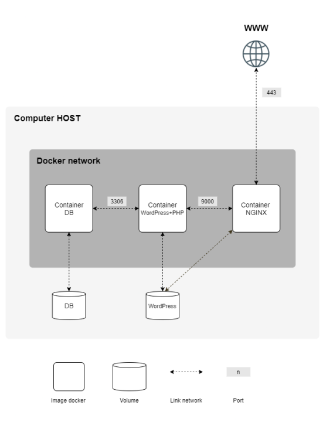

# Born2beroot

This project aims to broaden knowledge of system administration by using Docker.

## Tehnologies

<div align="center">

</div>

## Requirements

- All the files required for the configuration of your project must be placed in a srcs folder.
- Each Docker image must have the same name as its corresponding service.
- Dockerfiles, one per service.
- A Docker container that contains NGINX with TLSv1.2 or TLSv1.3 only.
- A Docker container that contains WordPress + php-fpm.
- A Docker container that contains MariaDB only without nginx.
- A volume that contains your WordPress database.
- A second volume that contains your WordPress website files.
- A docker-network that establishes the connection between your containers.

<div align="center">
	
</div>

## How to build

1. Create `.env` file in `srcs` directory. Example of enviroment variables:

```
DB_NAME=wordpress
DB_USER=wpuser
DB_PASS=wppass
DB_ROOT=rootpass
```

2. Create cert

```bash
cd srcs/requirements/nginx/tools
sudo openssl genrsa -out ./kgebski.42.fr.key 2048
sudo chmod 400 ./kgebski.42.fr.key
sudo openssl req -new -x509 -nodes -sha256 -days 365 -key ./kgebski.42.fr.key -out ./kgebski.42.fr.crt
```
3. Add side to host file

```bash
sudo vim /etc/hosts
```
add: `127.0.0.1		kgebski.42.fr` at the end of file.

4. Visit `https://kgebski.42.fr`
